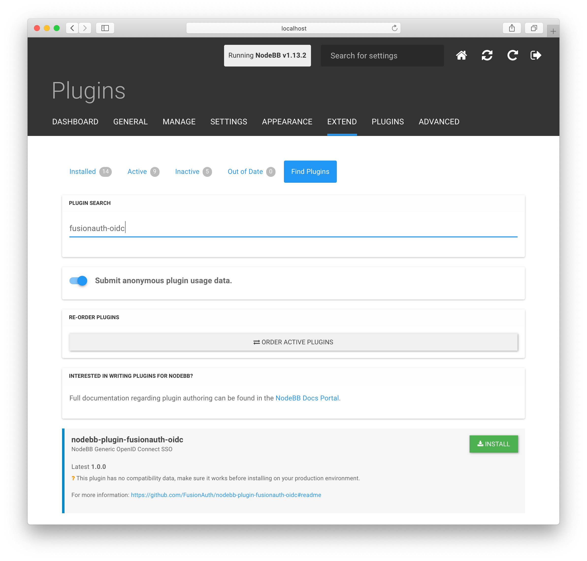
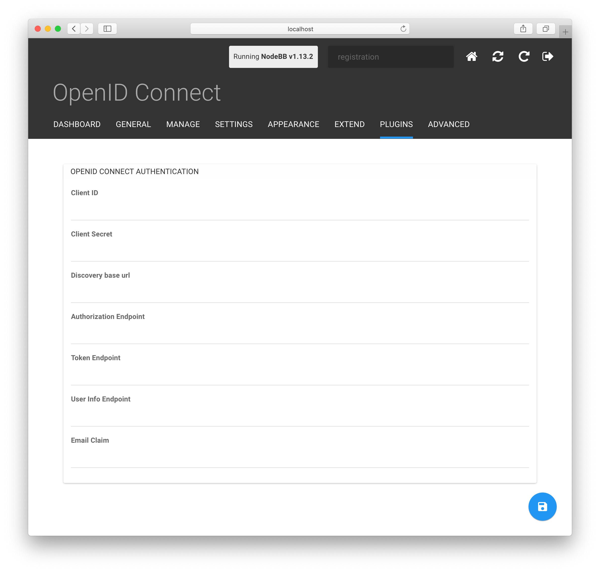
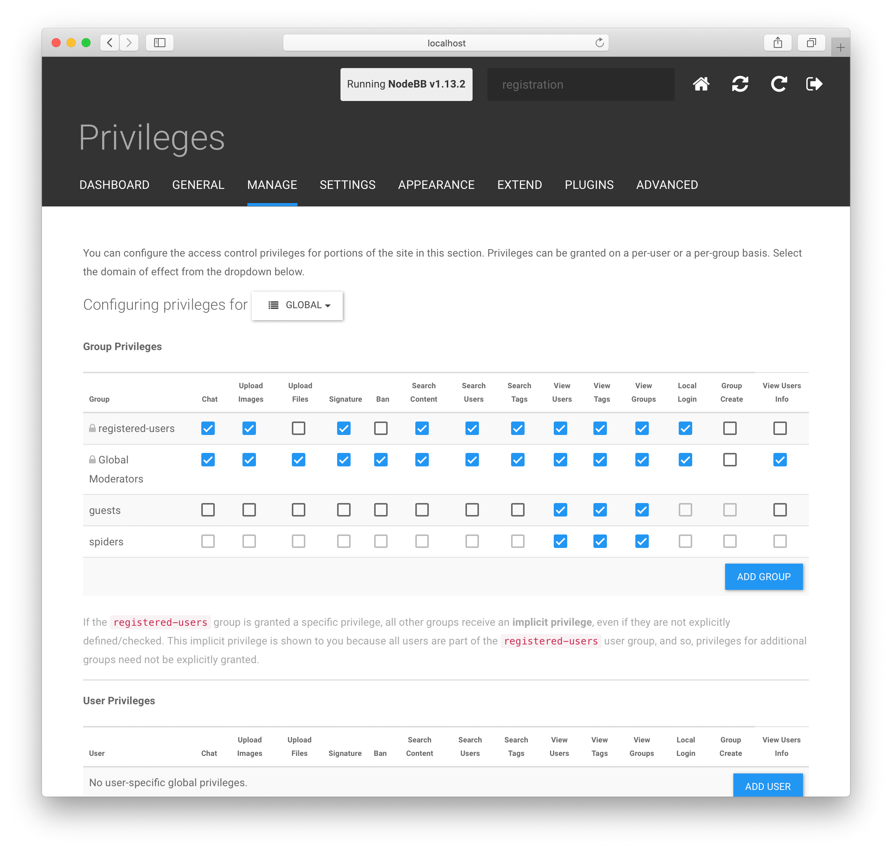

# NodeBB FusionAuth OpenID Connect

This plugin is developed and supported by FusionAuth but it is intended to work with any OpenID Connect identity provider.

If you find any issue or a missing feature, please open an issue.

## Features

* OpenID Connect Authentication
 * Authorization Code Grant
* Hot reloading of the authentication strategy
 * The configuration with the exception of the `Email claim` can be loaded without restarting NodeBB.

## Developing

1. Run `npm link` in this directory
1. Go to your NodeBB directory and run `npm link nodebb-plugin-fusionauth-oidc`
1. Run `./nodebb build`
1. Run `./nodebb dev`

## Installation

1. Launch NodeBB
1. Go to the admin portal
1. Select `Extend > Plugins` from the menu
1. Click `Find Plugins` from the sub-menu
1. Search for `fusionauth-oidc`

1. Click the `Install` button on the `nodebb-plugin-fusionauth-oidc` result
1. Click `Installed` from the sub-menu
1. Find the `nodebb-plugin-fusionauth-oidc` plugin and click `Activate`
1. Rebuild and restart NodeBB
1. Refresh the page to regenerate the menu

## Configuring

To configure the OpenID Connect plugin, perform the following steps to navigate to the configuration panel.

1. Select `Plugins > OpenID Connect` from the menu
1. You are now ready to configure the OpenID Connect plugin

You will need your Client Id, Client Secret and the endpoint URLs provided to you by your OpenID Connect identity provider.

If your OpenID Connect identity provider supports discovery, then you only need to enter the Client Id, Client Secret and Discovery base URL. If this is not available to you or discovery is not successful, you may also enter each endpoint manually .

Once you complete this configuration and save the form, you will need to restart NodeBB for the configuration to take effect.

| Field | Description |
| ----- | ----------- |
| Client ID | The unique Client Id provided to you by your IdP.  |
| Client secret | The client secret provided to you by your IdP.  In some cases this may not be provided to you if the IdP allows for non-confidential clients. |
|Discovery URL | When provided, this URL will be used to find the OpenID Connect discovery document. This URL will be appended with `.well-known/openid-configuration`. If this URL returns a JSON discovery document the remaining endpoints will be automatically resolved when you press the Save button. |
|Authorization endpoint | The fully qualified URL to the Authorization endpoint. |
|Token endpoint | The fully qualified URL to the Token endpoint. |
|Userinfo endpoint | The fully qualified URL to the Userinfo endpoint. |
|Logout endpoint | The fully qualified URL of the OpenID Connect logout endpoint. If configured, the browser will be redirected to this URL when you click logout in NodeBB.  | 
|Email claim | The name of the claim found in the response from the Userinfo endpoint that identifies the user's email address. This is generally `email` and is the default value. |
|Roles claim | If present, on login we will check this claim for the value `"admin"` and if present, give the user access to the admin panel. The claim value can either be a string or array of strings. Anything else will be treated as the user having no roles. |

This plugin will work with any OpenID Connect identity provider. If you are using FusionAuth, the values needed for this configuration will be found in your Application OAuth configuration. For more information, review the [OAuth configuration](https://fusionauth.io/docs/v1/tech/core-concepts/applications#oauth) tab of the Application configuration in the FusionAuth documentation.

If your provider requires a callback url then use `https://<domain>/auth/fusionauth-oidc/callback`

### Additional Configuration

If you want to skip the login page and always use the configured OpenID Connect identity provider for authentication you will need to disable Login Login and Local Registration.

#### To disable Local Login:
1. Select `Manage > Privileges` from the menu
1. Uncheck the appropriate boxes under the `Local Login` column in the `Group Privileges` table

#### To disable Local Registration:
1. Select `Settings > User` from the menu
1. Scroll down to the `User Registration` section and set `Registration Type` to `No Registration`
1. Click the Save icon

Once both Local Login and Local Registration have been disabled, the default login page will be skipped and the user will be automatically redirected to the OpenID Connect login page.

#### Recovery
If you need to login locally you can manually add the following parameter `/login?local=1` to your URL and you will be taken to the default login page.

#### Developer Notes

If you make changes to the plugin you will need to rebuild and reload. You can do this manually or via the UI.
